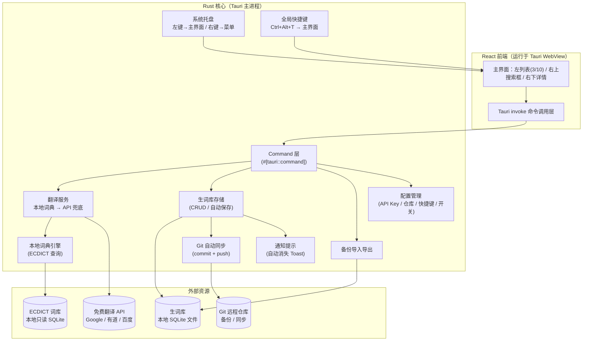

# TRNote 需求文档

> **TR = Translate & Record** —— 个人英语生词本
> 一句话：**遇到生词，翻译即记录，随时查阅。**

---

## 1. 产品定位

| 维度 | 结论 |
|------|------|
| 产品类型 | 个人英语生词本（翻译 + 记录） |
| 目标用户 | 本人，单用户 |
| 运行形态 | 本地桌面应用，**Node 技术栈，打包成 exe** |
| 数据形态 | 本地数据库文件，可上传 Git 备份/同步 |
| 登录/多用户 | 无 |

---

## 2. 核心业务流程

```
上网/编程遇到生词
   → 在 TRNote 输入单词 → 应用内翻译
   → 拼写正确、有对应词 → 默认【自动收录】成词条（可在设置中关闭，改手动确认）
   → 写入本地数据库
   → 自动尝试同步到 Git（可配置开关）
下次忘记时 → 打开应用 → 搜索/查阅词条
```

---

## 3. 功能需求

### 3.1 翻译与收录

**实时查词交互（主界面搜索框）**

1. 输入任意字母 → **立即**用本地词库在下方展示命中词建议（前缀/包含匹配，即时响应）
2. 停止输入约 **300ms**（防抖）后：若本地词库无对应结果 → 触发**网络查询**兜底
3. 搜索完成（确认单词，如回车/点击建议）→ **自动保存**该单词为词条，并在详情区展示

- **自动收录**：默认搜索完成后即自动保存；设置中可关闭，关闭后改为手动确认收录
- **去重**：单词已在库中则跳过重复保存，提示"已收录"（可选更新释义）
- 收录条件：拼写正确且能查到对应单词；本地 + 网络均查不到则不收录并给出提示

### 3.2 词条内容与展示

每个词条包含：

- **单词**
- **音标**（英式/美式）
- **多词性释义**：名词 / 动词 / 形容词 … 分开展示
- **词形变化**：过去式、过去分词、现在分词、复数、比较级等
- **例句**：词典自动带出，可手动补充
- **备注**：个人备注字段（替代"轻量笔记"）

**详情区展示形式（参考词典排版）**

- 顶部：**单词 + 音标**（英/美）
- 按**词性分区块**依次列出释义，同一词性下多个释义用「;」分隔，如：
  - `n.` 动作; 行为; 战斗; 处理
  - `v.` 行动; 起作用
- 各释义可带**例句**
- 底部：**词形变化**（过去式 / 复数 / 比较级…）+ **备注**编辑区
- 搜索框带「**清除**」按钮，可一键清空输入

### 3.3 主界面与浏览

**三部分布局**

```
┌─────────────────┬─────────────────────────────┐
│  单词本记录列表    │  [🔍 搜索框]                  │
│  （占宽 3/10）    ├─────────────────────────────┤
│  最新在最上        │                             │
│  单词 = 标题       │  单词详情展示                 │
│  翻译 = 摘要       │  （默认打开最新单词）          │
└─────────────────┴─────────────────────────────┘
```

| 区域 | 占比 | 内容 |
|------|------|------|
| 左：单词本记录列表 | 3/10 | 默认**最新在最上**（时间倒序），可切换**字母序**；每项**单词为标题**、**翻译为简略摘要**；点击某项 → 右侧展示该单词详情 |
| 右-上：搜索框 | — | 查词 / 翻译 / 筛选入口（见 3.1 实时查词交互） |
| 右-下：单词详情 | — | 单词完整展示（音标 / 多词性释义 / 词形变化 / 例句 / 备注），**默认打开最新单词** |

- 生词列表：全部生词一个池子（暂不做分类），长列表**虚拟滚动**
- **全文搜索**：按单词 / 释义 / 例句 / 备注 检索
- 词条基础 CRUD：查看、编辑、删除

### 3.4 备份与同步

- **整库一键导出 / 导入恢复**（手动备份）
- **自动 Git 同步**：每次有新词写入数据库后，自动 `git commit` + `git push`（直接调用 git，简单实现）
- Git 仓库地址与同步开关可配置；失败忽略、提供手动重试按钮

### 3.5 系统集成与快捷入口（Windows）

- **全局快捷键**（可自定义，默认 `Ctrl+Alt+T`）：任意界面下**直接弹出主界面**
- **系统托盘**：
  - 左键单击：弹出主界面（聚焦搜索框）
  - 右键菜单：**主界面 / 设置 / 退出**（三项）
- **搜索框**：位于主界面右上方，**筛选已收录 + 翻译收录一体**（本地有 → 筛选展示；本地无 → 网络翻译并自动收录，见 3.1）
- **收录后提示**：搜索完成、新词写入后 → 自动同步 Git → 应用内 **Toast** 提示（自动消失，失败可点重试）
- **设置页**：**独立窗口**弹出（托盘「设置」菜单或主界面入口打开），包含：
  - **首次使用**：第一次启动**默认弹出设置界面**，引导填写 **Git 仓库链接**（可跳过；未配置时每次启动提醒）
  - Git 同步：仓库链接 / 自动同步开关 / 手动同步
  - 全局快捷键自定义
  - 自动收录开关（默认开）
  - 翻译 API：接口选择与 **兜底顺序**（默认 Google → 有道 → 百度，**可拖动排序**）
  - 数据管理：导出备份 / 导入恢复
  - 关于

### 3.6 视觉风格

- **扁平化设计**：无多余阴影/拟物，以纯色块、圆角、留白为主
- **清新简洁**：低饱和配色、清晰层级，专注内容
- 具体配色与主题在界面原型阶段确认

---

## 4. 翻译来源（分层策略）

> 原则：**本地优先、离线可用，多源回退。**

| 层级 | 来源 | 作用 |
|------|------|------|
| L1 | **本地 ECDICT 词典库**（开源，约 76 万词条，含音标/词形/多词性） | 主力，离线秒查，覆盖日常/阅读词汇 |
| L2 | **免费翻译 API**：优先 Google 翻译（免费接口），失败/不稳定时回退 有道 / 百度 免费接口 | 兜底，覆盖本地库缺失词 |
| L3 | **内置开源编程术语表** | 弥补本地库在编程术语上的薄弱 |

注意事项：

- Google **官方** Cloud Translation API 是付费的；免费可用的为非官方接口，**可能不稳定**，因此设计为：多源可配置 + 自动回退。
- **默认兜底顺序：Google 翻译（免费接口）→ 有道翻译 → 百度翻译**；设置页中**可拖动调整**该顺序。
- API Key / 接口选择做成可配置项，默认使用免费方案。

---

## 5. 明确不做（边界）

- ❌ 分类 / 标签（全部生词一个池子）
- ❌ 复习 / 背单词 / 提醒
- ❌ 发音朗读
- ❌ 来源网址记录
- ❌ 独立笔记分区（用词条"备注"字段代替）
- ❌ 多用户 / 登录 / 云端服务
- ❌ 富文本 / 图片 / 附件（词条为结构化文本）

---

## 6. 技术方向

### 已定
- **Node 技术栈**（前端构建工具链）
- **前端：React**
- **桌面框架：Tauri**（Rust 核心，由开发助手编写实现）
- **打包成 exe**（本地桌面应用，Tauri 体积小、资源占用低）
- **数据为本地数据库文件**，可直接上传 Git
- **自动 Git 同步**（写入后直接调 `git commit` + `git push`，失败忽略/手动重试）
- **数据库：SQLite**（单文件、易 git；生词库与设置均存 SQLite）
- **ECDICT 词库**：随应用打包为只读 SQLite 文件；启动时建立**内存前缀索引**（词 → id）实现"输入即出"的即时建议，命中后按需从 SQLite 取完整词条（释义/音标/词形）

### 遗留待定（细节，实现阶段补充）
- 网络兜底接口的具体选择与 Key 配置（Google 非官方 / 有道 / 百度 回退链）
- 界面配色与主题细节（原型阶段确认）

### 开发约定
- **代码注释**：Rust / React 代码需包含清晰的中文注释，标注模块职责与关键逻辑，便于非 Rust 背景的维护者理解
- **文档**：本文件维护架构图与模块说明，随代码演进同步更新

---

## 7. 系统架构



---

## 8. 数据库设计（已定，SQLite）

> ECDICT 为**独立只读库**，不混入本结构；收录时把展示所需字段（音标/释义/词形/例句）**快照**进下表，之后可手动编辑。

**words —— 词条主表**

| 字段 | 类型 | 说明 |
|------|------|------|
| id | INTEGER PK | 自增 |
| word | TEXT UNIQUE | 单词（唯一，用于去重） |
| phonetic_uk | TEXT | 英式音标 |
| phonetic_us | TEXT | 美式音标 |
| note | TEXT | 个人备注 |
| created_at | TEXT | 收录时间（ISO8601，用于"最新在上"排序） |
| updated_at | TEXT | 更新时间 |

**senses —— 释义（多词性）**

| 字段 | 类型 | 说明 |
|------|------|------|
| id | INTEGER PK | 自增 |
| word_id | INTEGER FK→words.id | 所属词条 |
| pos | TEXT | 词性：n. / v. / adj. / adv. … |
| meaning | TEXT | 中文释义 |
| example | TEXT | 例句（词典带出或手动补充） |
| sort | INTEGER | 展示顺序 |

**forms —— 词形变化**

| 字段 | 类型 | 说明 |
|------|------|------|
| id | INTEGER PK | 自增 |
| word_id | INTEGER FK→words.id | 所属词条 |
| type | TEXT | 过去式 / 过去分词 / 复数 / 比较级 / 最高级… |
| value | TEXT | 词形值 |

**settings —— 全局配置（key-value）**

| 字段 | 类型 | 说明 |
|------|------|------|
| key | TEXT PK | 配置项 |
| value | TEXT | 值（快捷键、git 仓库、开关、API Key 等） |

---

## 9. 后续计划（待讨论）

- [x] 需求澄清（本文件）
- [x] 技术选型（Tauri / React / SQLite / ECDICT）
- [x] 主界面布局与详情展示形式
- [x] 数据库结构设计
- [x] 界面原型（`prototype/index.html`，双击打开，扁平化清新风格）
- [ ] 设置页原型完善
- [ ] Git 自动同步细节（仓库初始化引导）
- [ ] 免费 API 选择与 Key 配置方案
- [ ] 实现任务拆分
